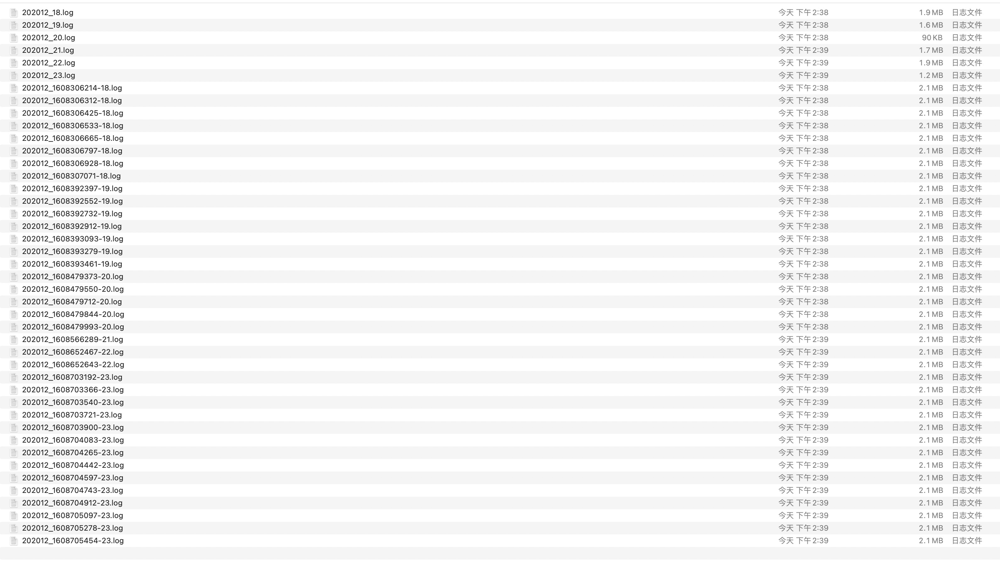

ThinkPHP3和5全日志扫描脚本

### 安装

```
git clone https://github.com/r3change/TPLogScan.git
cd TPLogScan/
pip install -r requirements.txt
```

### 使用

```
> python3 TPLogScan.py -h

usage: TPLogScan.py [-h] [-u URL] [-v {3,5}] [-p PATH] [-y YEAR] [-m MONTH] [-d DAY]

Thinkphp 3 or 5 log file scan!

optional arguments:
  -h, --help            show this help message and exit
  -u URL, --url URL     target url
  -v {3,5}, --version {3,5}
                        thinkphp version, default 3
  -p PATH, --path PATH  log path
  -y YEAR, --year YEAR  datetime year, default 2020
  -m MONTH, --month MONTH
                        datetime start month, default 1
  -d DAY, --day DAY     datetime start day, default 1
```

扫描TP3 1月-本月的网站所有日志
```
python3 TPLogScan.py -u URL
```

扫描TP5 12月的网站所有日志
```
python3 TPLogScan.py -u URL -v 5 -m 12
```

指定日志路径扫描（需同时指定ThinkPHP版本）
```
python3 TPLogScan.py -u URL -v 5 -p /runtime/log/ -m 12 -d 25
```


扫描结果自动保存在 `/TPLogData/{URL}/` 目录下

