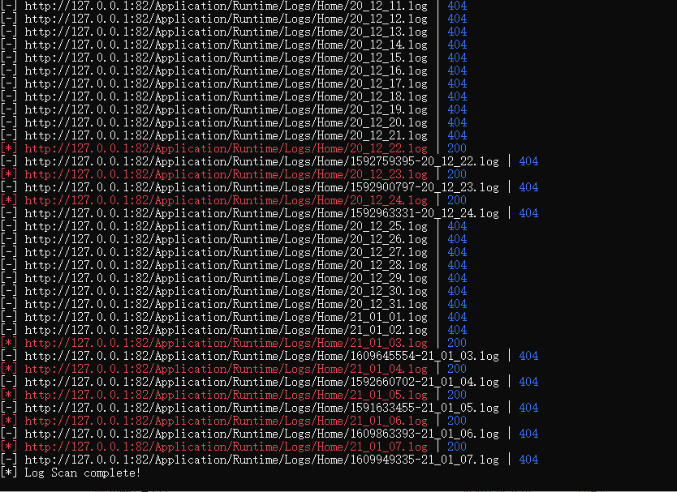
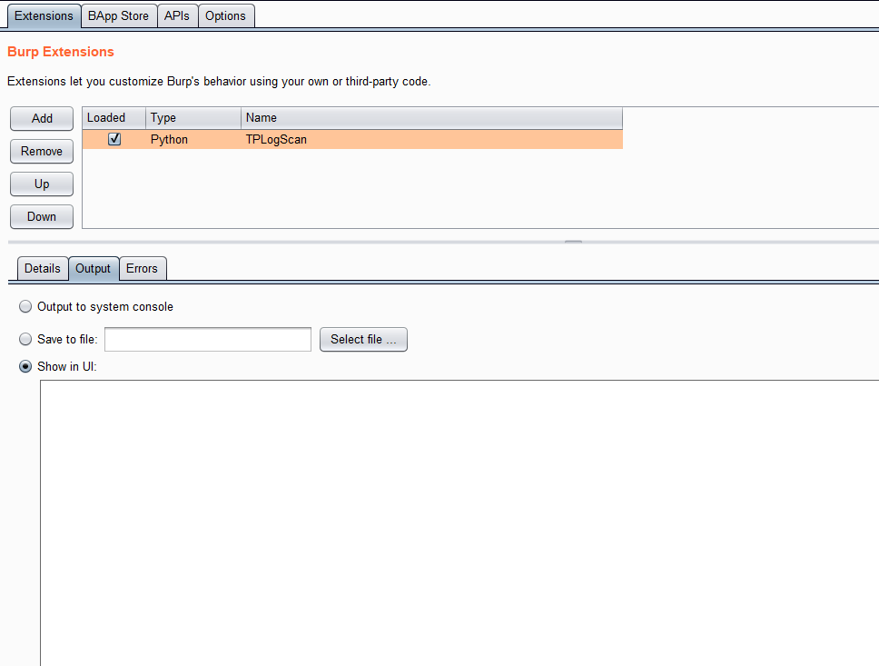
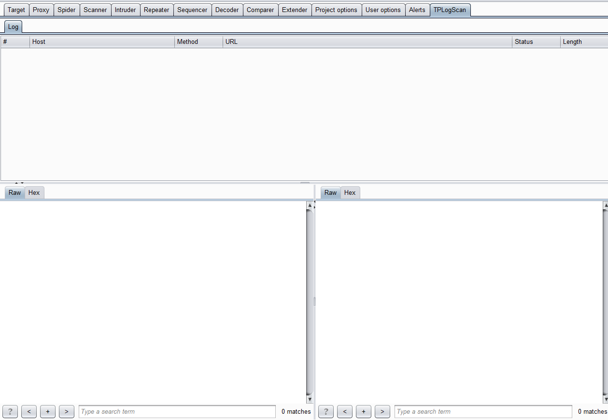
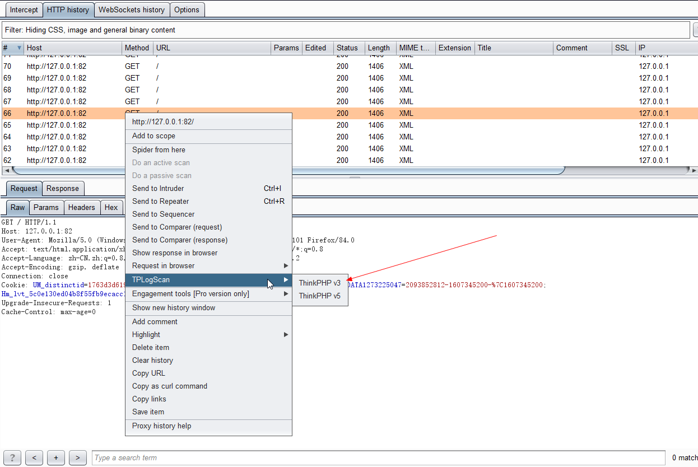
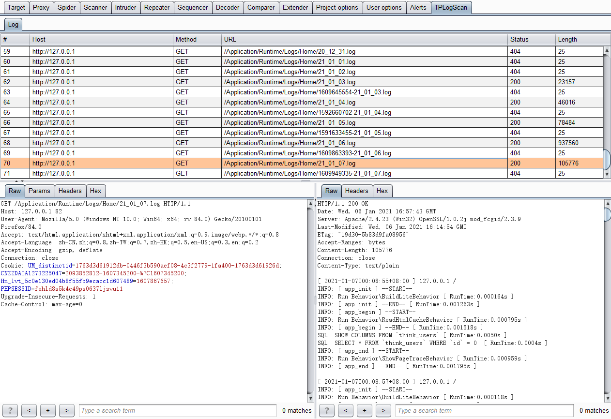

ThinkPHP3和5日志扫描工具，提供命令行版和BurpSuite插件版，尽可能全的发掘网站日志信息

## 命令行版

### 安装

```
git clone https://github.com/r3change/TPLogScan.git
cd TPLogScan/
pip install -r requirements.txt
```

### 使用

```
> python3 TPLogScan.py -h

usage: TPLogScan.py [-h] [-u URL] [-v {3,5}] [-p PATH] [-y YEAR] [-m MONTH]
                    [-d DAY]

Thinkphp 3 or 5 log file scan!

optional arguments:
  -h, --help            show this help message and exit
  -u URL, --url URL     target url
  -v {3,5}, --version {3,5}
                        thinkphp version, default 3
  -p PATH, --path PATH  log path
  -y YEAR, --year YEAR  datetime start year, default this year
  -m MONTH, --month MONTH
                        datetime start month, default this month
  -d DAY, --day DAY     datetime start day, default 1
```

扫描TP3 1月-本月的网站所有日志
```
python3 TPLogScan.py -u URL
```

扫描TP5 12月的网站所有日志
```
python3 TPLogScan.py -u URL -v 5 -m 12
```

指定日志路径扫描（需同时指定ThinkPHP版本）
```
python3 TPLogScan.py -u URL -v 5 -p /runtime/log/ -m 12 -d 25
```

扫描截图




扫描结果自动保存在 `/TPLogData/{URL}/` 目录下


## BurpSuite插件版

### 安装

插件使用Python编写，使用需要先下载 Jython，并在 BurpSuite 中配置

Jython下载地址
```
https://www.jython.org/download.html
```

配置Jython环境


添加插件



插件添加后会新建一个标签页面板



### 使用

右键菜单选择TPLogScan，根据ThinkPHP版本选择子菜单项，选择后会自动爬取近30天的日志，会将请求记录在新建的面板中




